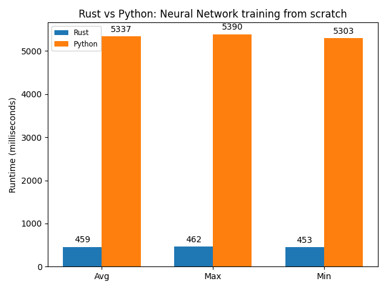

# nn-rust-vs-python

:fist_right: :fist_left: Rust vs Python for training a Neural Network from scratch

This is a small experiment to compare the performance of Rust vs Python (with Numpy) for training a Neural Network from scratch.

## Experimental Setup

I implemented a Neural Network from scratch in both Rust and Python. In both implementations, I leveraged libraries for performing vectorized operations on matrices. For Rust it's the `ndarray` crate, and for Python, the `NumPy` package.

The Neural Network was tasked to learn the `XOR` function with a small architecture, as follows:

- 2 input features
- 2 hidden neurons
- 1 output neuron

To compute the runtimes for each implementation, I trained the network 10 times each with a different random seed. Each trial ran Gradient Descent for 100,000 epochs. In total, then, the learning process was repreated a million times.

## Hardware Setup

- Operating System: MacOS Big Sur (11.1)
- Processor: 2.5 GHz Dual-Core Intel Core i7
- Memory: 16 GB 2133 MHz LPDDR3

## Results

To compare the two languages I computed the average, max and min runtime in milliseconds as shown in the plot below.

  

As we can see, Rust was roughly **11 times faster** than Python at training this network. The results are not completely unexpected though. Rust is a compiled language that has comparable performance to C. NumPy's backend is pure C code, however. So it was interesting to see that even when using highly-optimized vectorized operations, Rust could still accelerate Machine Learning algorithms substantially.

So does this mean I'm going to start using Rust for developing algorithms? No, not really. Rust is blazingly fast, but Python's inmense ecosystem of libraries and frameworks, and overall quicker development time, make it the true winner.

## Disclaimer

There are ways to compile NumPy to increase its performance, and maybe that would get it closer to the runtimes of Rust. This was a small experiment performed with an out-of-the-box NumPy library. Experimenting with these enhancements was out of scope.
